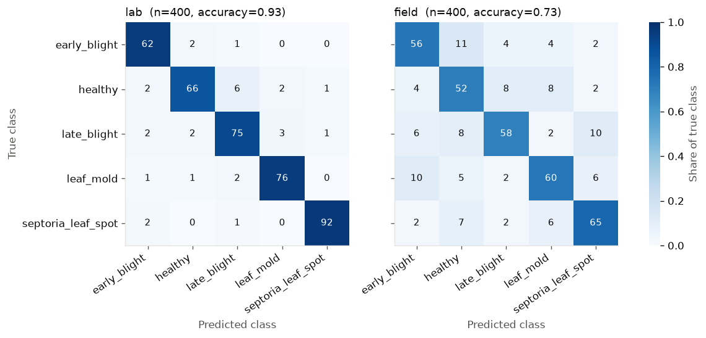
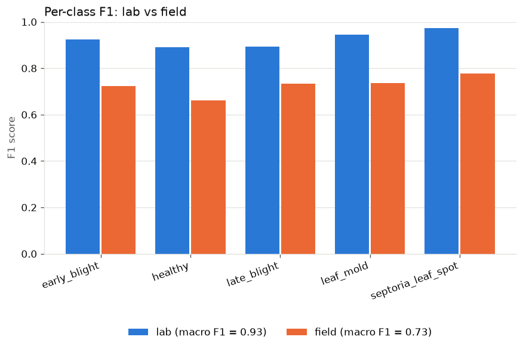

# cropeval report

Input: `demo_predictions.csv` (800 rows)

## Summary

| domain | n | accuracy | macro F1 |
|---|---:|---:|---:|
| lab | 400 | 0.927 | 0.926 |
| field | 400 | 0.728 | 0.727 |

**Accuracy gap (lab − field): +0.200**, 95% bootstrap CI [+0.147, +0.250] (n_boot=1000, seed=0).

The model is significantly less accurate on field images.

## Per-class F1

| class | lab F1 | field F1 | difference |
|---|---:|---:|---:|
| early_blight | 0.925 | 0.723 | +0.203 |
| healthy | 0.892 | 0.662 | +0.229 |
| late_blight | 0.893 | 0.734 | +0.159 |
| leaf_mold | 0.944 | 0.736 | +0.208 |
| septoria_leaf_spot | 0.974 | 0.778 | +0.195 |

## Plots

